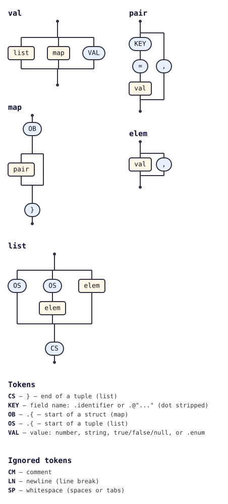

# @tabnas/zon

<!-- tabnas-badges -->
[](https://www.npmjs.com/package/@tabnas/zon)
[](https://github.com/tabnas/zon/actions/workflows/ci.yml)
[](https://pkg.go.dev/github.com/tabnas/zon/go)
[](https://tabnas.github.io/status/)
<!-- /tabnas-badges -->

A grammar plugin that teaches the [Tabnas](https://github.com/tabnas/parser)
parser to read [Zig Object Notation (ZON)](https://ziglang.org/documentation/master/#ZON),
the anonymous-struct data format used for `build.zig.zon` manifests.
Available for TypeScript, Go and Rust, built on the same grammar.

Docs, guides, the error reference and the playground: **[tabnas.dev](https://tabnas.dev)**.

ZON looks like this:

```zon
.{
    .name = "example",
    .version = "0.0.1",
    .dependencies = .{
        .foo = .{ .url = "https://example.com/foo.tar.gz", .hash = "1220deadbeef" },
    },
    .paths = .{ "build.zig", "src" },
}
```

## Install

```bash
# TypeScript / JavaScript
npm install @tabnas/parser @tabnas/jsonic @tabnas/zon

# Go
go get github.com/tabnas/zon/go@latest
```

The Rust crate, `tabnas-zon` in [`rs/`](rs/), is consumed as a sibling
checkout beside `tabnas/parser`, `tabnas/json` and `tabnas/jsonic`; see
[`rs/README.md`](rs/README.md).

## One tiny example

**TypeScript.** The plugin layers onto a Tabnas engine:

```js
import { Tabnas } from '@tabnas/parser'
import { jsonic } from '@tabnas/jsonic'
import { Zon } from '@tabnas/zon'

const j = new Tabnas().use(jsonic).use(Zon)

j.parse('.{ .name = "Alice", .age = 30 }') // => { name: 'Alice', age: 30 }
j.parse('.{ 1, 2, 3 }')                     // => [1, 2, 3]
```

**Go.** `tabnaszon.Parse` is the one-call entry point:

```go
import tabnaszon "github.com/tabnas/zon/go"

result, _ := tabnaszon.Parse(`.{ .name = "Alice", .age = 30 }`)
// map[string]any{"name": "Alice", "age": float64(30)}
```

**Rust.** `tabnas_zon::parse` reuses one shared instance:

```rust
let value = tabnas_zon::parse(".{ .name = \"Alice\", .age = 30 }")?;
// {"name":"Alice","age":30}
```

## Conformance

On every document in the two corpora below, `@tabnas/zon` gives the
verdict **ziglang/zig 0.16.0** gives, and the same value for each accepted
one. The reference implementation is the judge, not this repo:
`scripts/fetch-zigzon.sh` downloads a pinned zig 0.16.0, builds a small
oracle around the compiler's own `std.zig.Ast` + `std.zig.ZonGen`, and has
it rule on every ZON document in the zig tree.

| Corpus | Documents | Accepted correctly | Rejected correctly |
|---|---|---|---|
| Every `.zon` file in the zig tree, plus every snippet in `lib/std/zon/parse.zig` | 228 | 184 / 184 | 44 / 44 |
| Leniency probes (`test/strictness/inputs.txt`), judged by the same oracle | 129 | 49 / 49 | 80 / 80 |

Identical in all three runtimes. A corpus is a measurement, not a proof:
the inputs outside both corpora on which a runtime is known to differ
from the oracle, or from another runtime, are listed with their
measurements in [`DIVERGENCE.md`](DIVERGENCE.md). Two documented
deviations, both about representing a value that Zig resolves against a
target type:

- an integer literal too large for an exact IEEE-754 double is returned as a
  `bigint` (TypeScript) / `*big.Int` (Go) / a `{ "$big": "<digits>" }`
  object (Rust) rather than silently rounded;
- `.{}` parses as the empty **list**, since an empty anonymous literal is both
  an empty struct and an empty tuple until a type says otherwise.

See [`AGENTS.md`](AGENTS.md#conformance-claim) for the full details.

## Documentation

Full documentation follows the [Diátaxis](https://diataxis.fr)
framework: one file per quadrant, per language:

| | TypeScript | Go |
|---|---|---|
| **Tutorial** (learning) | [ts/doc/tutorial.md](ts/doc/tutorial.md) | [go/doc/tutorial.md](go/doc/tutorial.md) |
| **How-to guide** (tasks) | [ts/doc/guide.md](ts/doc/guide.md) | [go/doc/guide.md](go/doc/guide.md) |
| **Reference** (API + options + syntax) | [ts/doc/reference.md](ts/doc/reference.md) | [go/doc/reference.md](go/doc/reference.md) |
| **Concepts** (explanation) | [ts/doc/concepts.md](ts/doc/concepts.md) | [go/doc/concepts.md](go/doc/concepts.md) |

Per-language hubs: [`ts/README.md`](ts/README.md),
[`go/README.md`](go/README.md), [`rs/README.md`](rs/README.md) (the Rust
crate has its front page only; the docs above describe the same grammar).

## Grammar diagram

The grammar is defined once in the top-level
[`zon-grammar.jsonic`](zon-grammar.jsonic) and embedded into all three
implementations, TypeScript ([`ts/src/zon.ts`](ts/src/zon.ts)), Go
([`go/zon.go`](go/zon.go)) and Rust ([`rs/src/lib.rs`](rs/src/lib.rs)), by
[`ts/embed-grammar.js`](ts/embed-grammar.js) during the TypeScript build. Edit the grammar there, not in the
generated sources.

As a railroad/syntax diagram, generated from the live grammar with
[`@tabnas/railroad`](https://github.com/tabnas/railroad):



ASCII version: [`ts/doc/grammar.txt`](ts/doc/grammar.txt).

## License

MIT. Copyright (c) Richard Rodger.
