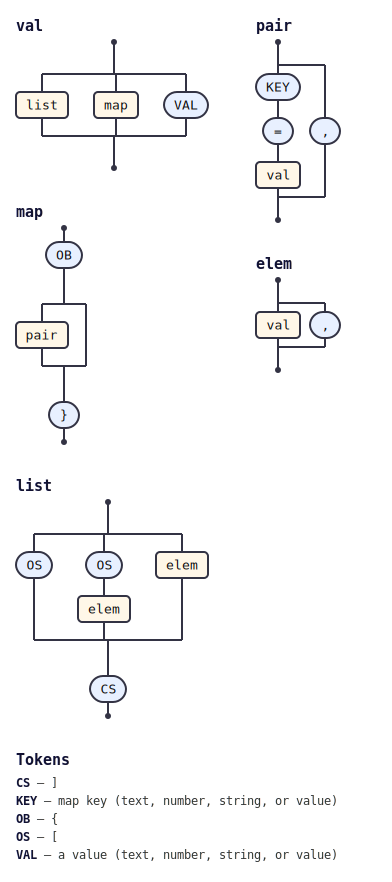

# @tabnas/zon

A [Tabnas](https://github.com/tabnas/parser) grammar plugin that parses
[Zig Object Notation (ZON)](https://ziglang.org/documentation/master/#ZON)
text into objects, arrays, and scalar values. ZON is the anonymous-struct
data format used for Zig `build.zig.zon` manifests.

## Install

```bash
npm install @tabnas/parser @tabnas/jsonic @tabnas/zon
```

Requires `@tabnas/parser` >= 2 and `@tabnas/jsonic` >= 2 as peer
dependencies.

## One example

The plugin layers onto a Tabnas engine that already has the jsonic
grammar:

```js
import { Tabnas } from '@tabnas/parser'
import { jsonic } from '@tabnas/jsonic'
import { Zon } from '@tabnas/zon'

const j = new Tabnas().use(jsonic).use(Zon)

j.parse('.{ .name = "Alice", .age = 30 }') // => { name: 'Alice', age: 30 }
j.parse('.{ 1, 2, 3 }')                     // => [1, 2, 3]
```

Build the instance once and reuse it — constructing the grammar is the
expensive part.

## Documentation

Full documentation follows the [Diátaxis](https://diataxis.fr)
framework:

- [Tutorial](doc/tutorial.md) — a guided first parse, start to finish.
- [How-to guide](doc/guide.md) — short recipes for individual tasks.
- [Reference](doc/reference.md) — the public API, every option, and the
  complete ZON syntax accepted.
- [Concepts](doc/concepts.md) — how the plugin reshapes the engine, and
  why.

For the Go port, see [`../go/README.md`](../go/README.md).

## Grammar diagram

The grammar is defined in the top-level
[`zon-grammar.jsonic`](../zon-grammar.jsonic) and embedded into this
implementation (and the Go port) by [`embed-grammar.js`](embed-grammar.js)
during the build.

The installed grammar as a railroad/syntax diagram, generated with
[`@tabnas/railroad`](https://github.com/tabnas/railroad):



A vertical ASCII version is in [`doc/grammar.txt`](doc/grammar.txt).

## License

Copyright (c) 2025 Richard Rodger and other contributors,
[MIT License](LICENSE).
